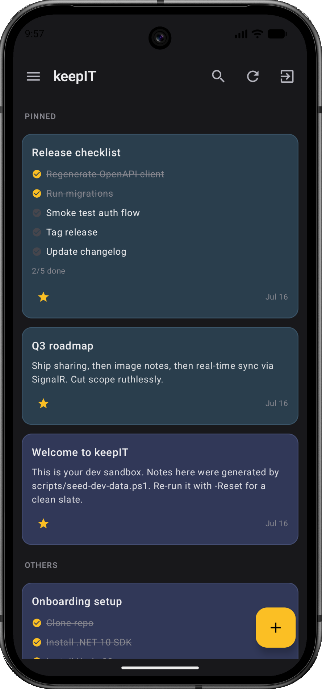

<div align="center">


# keepIT

**A modern, real-time notes app you can run yourself.**

[](https://hub.docker.com/r/richy1989/keepit)
[](#the-android-app)
[](LICENSE)


</div>

<div align="center">
  
  &nbsp;&nbsp;&nbsp;&nbsp;
  
</div>

Honestly? I just wanted a simple notes app, and couldn't find one with the three things I
actually cared about — so I built it myself. With a little AI help 😉, modern problems require modern solutions.

The features I really wanted:

- a simple notes app with a modern web UI
- note sharing between different users
- a native Android app, including a home-screen widget

It has since grown into a blazing-fast app with optimistic editing, lists, search, sharing, and **real-time sync** — so a note edited on one device shows up on your others without a refresh. I'm really happy with how this turned out.

> **Status:** work in progress.

## Contents

- [What you can do with it](#what-you-can-do-with-it)
- [Run your own keepIT](#run-your-own-keepit)
- [The Android app](#the-android-app)
- [What's next](#whats-next)
- [For developers](#for-developers)
- [License](#license)

## What you can do with it

- 📝 **Write notes your way** — quick text notes with rich formatting (bold, headings, lists,
  links, code), or checklists you tick off as you go.
- 🗂️ **Stay organized** — group notes into lists, pin the important ones to the top, archive
  what's done, and find anything instantly with search. Deleted notes wait in the trash until
  you're sure.
- 🎨 **Make it yours** — give any note a background color, and pick your own accent color for
  the whole app.
- ⏰ **Reminders** — remind yourself about any note, once or on a schedule (daily, weekly,
  monthly, yearly). On your phone they arrive as real notifications — even with the app closed,
  the screen locked, or no internet.
- 👥 **Share notes** — invite someone by email to view or edit a note with you. You each keep
  your own pins, lists, and reminders; edits show up for everyone, live.
- 🔄 **Always in sync** — change a note on one device and watch it update on your others,
  no refresh needed.
- 📱 **Android app included** — the same notes on your phone, with a home-screen widget for
  recent notes and one-tap capture. It works fully offline: read and edit anywhere, and your
  changes sync as soon as you're back online.
- 🔒 **Your notes stay yours** — keepIT is self-hosted. Everything lives on **your** server,
  no third-party cloud, no account with anyone but yourself.

*Coming up: photos and images in notes — see [What's next](#whats-next).*

## Run your own keepIT

keepIT runs on your own machine or home server with **Docker**. One command, no database to set
up:

```bash
docker run -d \
  --name keepit \
  -p 8080:80 \
  -v keepit-data:/data \
  -e Jwt__Key="your-random-secret-at-least-32-chars" \
  richy1989/keepit:latest
```

Then open **http://localhost:8080** (or your server's address on port 8080) and create your
account. That's it.

A few things worth knowing:

- **`Jwt__Key`** is a secret that keeps your sign-ins secure — replace it with any random string
  of at least 32 characters, and keep it the same across restarts.
- **Your data** lives in the `keepit-data` volume — back that up and you've backed up your notes.
- **Once your accounts are created**, you can close public sign-up by adding
  `-e App__AllowRegistration=false` — recommended if your server is reachable from the internet.
- **Forgot password** works without any mail server: the reset link is written to the server
  log (`docker logs keepit`), where you — the operator — can grab it. To have it emailed to
  users instead, configure SMTP with the `Email__*` settings below.
- Running **Unraid**? A Community Apps template is included at
  [`deploy/keepit.unraid.xml`](deploy/keepit.unraid.xml).

<details>
<summary><strong>Prefer Docker Compose, Postgres, or building the image yourself?</strong></summary>

**Docker Compose** (three containers: app, web server, and a PostgreSQL database) — from a clone
of this repo:

```bash
cp .env.example .env          # set JWT_KEY (32+ chars), optionally POSTGRES_PASSWORD
docker compose up -d --build  # builds everything locally, then starts the stack
```

Open **http://localhost:8080**. Data persists in named Docker volumes.

**Use PostgreSQL with the single container** instead of the built-in database:

```bash
docker run -d \
  --name keepit \
  -p 8080:80 \
  -v keepit-data:/data \
  -e Jwt__Key="your-secret" \
  -e "ConnectionStrings__Postgres=Host=<host>;Port=5432;Database=keepit;Username=keepit;Password=<pass>" \
  richy1989/keepit:latest
```

**Build the image yourself** (no Docker Hub needed):

```bash
docker build -f deploy/Dockerfile -t keepit:local .
docker run -d --name keepit -p 8080:80 -v keepit-data:/data \
  -e Jwt__Key="your-random-secret-at-least-32-chars" keepit:local
```

</details>

<details>
<summary><strong>All settings (environment variables)</strong></summary>

| Variable | Required | Default | Description |
| --- | --- | --- | --- |
| `Jwt__Key` | **yes** | — | Random secret, min 32 chars — keeps sign-ins secure. **The variable the app actually reads**; use it for `docker run` / Unraid / the single-container image. |
| `JWT_KEY` | compose only | — | Convenience `.env` value that `docker-compose.yml` passes through as `Jwt__Key`. Not read directly by the app. |
| `POSTGRES_PASSWORD` | no | `keepit` | Postgres password (used in the Compose stack). |
| `ConnectionStrings__Postgres` | no | *(built-in SQLite)* | Full Postgres connection string. If empty, a zero-setup SQLite database is used. |
| `App__AllowRegistration` | no | `true` | Whether new accounts may be created. On an internet-exposed instance: register your own accounts first, then set `false` to close public sign-up. |
| `App__DataRoot` | no | `./App_Data` | Directory for the database, security keys, and media. |
| `App__ForwardedProxyHops` | no | `1` | Trusted reverse-proxy hops in front of the app — `1` for the plain setups above, `2` if you put another proxy (e.g. Traefik) in front. |
| `App__PublicBaseUrl` | no | *(auto-detected)* | Public address of your instance (e.g. `https://notes.example.com`), used to build password-reset links. Usually auto-detected from the request; set it if reset links point to the wrong host. |
| `Email__SmtpHost` | no | — | SMTP server for outgoing email (password-reset links). Leave empty to run without email — reset links then land in the server log. |
| `Email__From` | with SMTP | — | From address, e.g. `keepIT <no-reply@example.com>`. Required once `Email__SmtpHost` is set. |
| `Email__SmtpUsername` | no | — | SMTP login username. Leave empty (along with the password) for an unauthenticated relay. |
| `Email__SmtpPassword` | no | — | SMTP login password, paired with `Email__SmtpUsername`. |
| `Email__SmtpPort` | no | `587` | SMTP port — `587` for STARTTLS submission, `465` for implicit TLS (set `Email__UseStartTls=false` too). |
| `Email__UseStartTls` | no | `true` | `true` = STARTTLS (port 587); `false` = implicit TLS (port 465). |
| `Auth__RefreshCookie__Secure` | no | `true` (Compose) / `false` (single container) | Sign-in cookie is HTTPS-only. Keep `true` behind TLS; set `false` only when serving plain HTTP on a non-localhost address (e.g. a LAN IP without TLS). |
| `Jwt__Issuer` / `Jwt__Audience` | no | `keepITCore` / `keepIT.api` | Advanced: token claims. |
| `Jwt__AccessTokenMinutes` / `Jwt__RefreshTokenDays` | no | `15` / `14` | Advanced: how long sign-in tokens last. |
| `ASPNETCORE_ENVIRONMENT` | no | `Production` | Set to `Development` for verbose logging and the API explorer at `/scalar/v1`. |

The Compose stack sets most of these itself and reads only five values from `.env`: `JWT_KEY`,
`POSTGRES_PASSWORD`, `REFRESH_COOKIE_SECURE`, `FORWARDED_PROXY_HOPS`, and `ALLOW_REGISTRATION`.

</details>

## The Android app

The app in [`app/`](app) brings your notes to your phone: offline-first, live sync, native
reminder notifications, and a home-screen widget. It isn't on the Play Store (yet), so you build
and install it yourself — open `app/` in **Android Studio**, or from the command line (requires
the Android SDK):

```bash
cd app
./gradlew :app:assembleDebug     # build the APK
./gradlew :app:installDebug      # or install straight onto a connected phone
```

On first launch, enter your **server address** on the sign-in screen — the same URL you open in
the browser (from the Android emulator, your own machine is `http://10.0.2.2:5025`). For
reminders that fire on the minute even while your phone sleeps, grant **Alarms & reminders**
in the app's Settings screen.

## What's next

- 🖼️ **Photos & images in notes** — attach images, and use one as a note's background.
- 📤 **Sharing from the phone** — invite people to a note directly in the Android app.
- ✉️ **Invite anyone** — share a note with someone who hasn't signed up yet.

## For developers

Interested in how it works or want to hack on it? **[`ARCHITECTURE.md`](ARCHITECTURE.md)** holds
the full design and reasoning. The short version: an ASP.NET Core (.NET 10) REST API + SignalR
for realtime, a React 19/TypeScript web app, and a Kotlin/Jetpack Compose Android app — all
speaking the same API, with the C# DTOs as the single source of truth for the contract (the
typed TS client is generated from OpenAPI: `cd web && npm run generate:api`).

Run it locally with the **.NET 10 SDK** and **Node.js 22+** (no database setup needed — a SQLite
dev database is created automatically):

```bash
# 1) Backend — http://localhost:5025 (Scalar API UI at /scalar/v1)
dotnet run --project keepIT/keepITCore

# 2) Frontend — http://localhost:5173 (proxies /api to the backend)
cd web && npm install && npm run dev
```

Open **http://localhost:5173** and register an account — or seed test data
(`test@test.com` / `Test1234#1234`, plus lists and a variety of notes):

```bash
./scripts/seed-dev-data.sh        # PowerShell twin: ./scripts/seed-dev-data.ps1
```

## License

Released under the [MIT License](LICENSE) — © 2026 Richard Leopold. Free to use, modify, and
distribute; just keep the copyright and license notice.
