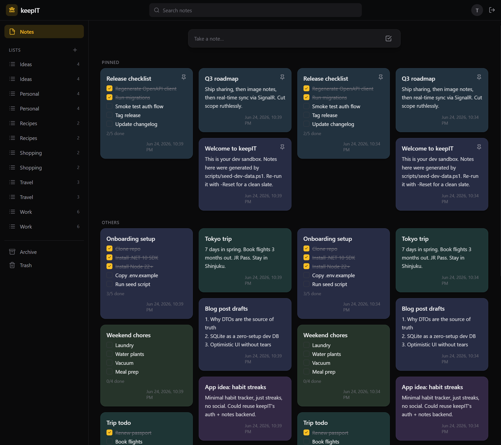

<div align="center">


# keepIT

**A modern, real-time notes app.**

[](https://dotnet.microsoft.com/)
[](https://react.dev/)
[](https://www.typescriptlang.org/)
[](https://vite.dev/)
[](https://www.postgresql.org/)
[](https://docs.docker.com/compose/)
[](LICENSE)


</div>

<div align="center"></div>

Honestly? I just wanted a simple notes app, and couldn't find one with the three things I
actually cared about — so I built it myself. With a little AI help 😉, modern problems require modern solutions.

The features I really wanted:

- a simple notes app with a modern web UI
- note sharing between different users
- a native Android app, including a home-screen widget

It's since grown into a masonry grid of note cards with fast, optimistic editing, lists, search,
sharing, and **real-time sync** — so a note edited on one device shows up on your others without
a refresh.

> **Status:** work in progress.

## Contents

- [Features](#features)
- [Roadmap](#roadmap)
- [Tech stack](#tech-stack)
- [Architecture at a glance](#architecture-at-a-glance)
- [Project structure](#project-structure)
- [Getting started](#getting-started)
  - [Local dev (two terminals)](#local-dev-two-terminals)
  - [Seed dev data](#seed-dev-data)
  - [Full stack (Docker Compose)](#full-stack-docker-compose)
- [Deploy](#deploy)
  - [Option 1 — Docker Compose (multi-container)](#option-1--docker-compose-multi-container)
  - [Option 2 — Single container (Unraid / simple hosts)](#option-2--single-container-unraid--simple-hosts)
  - [Environment variables](#environment-variables)
- [Regenerating the API client](#regenerating-the-api-client)
- [License](#license)

## Features

Notes come in several types, and any note can be styled:

- 📝 **Text notes** — free-form text. ✅
- ☑️ **Checklist notes** — checkbox items, tick inline, reorderable. ✅
- 🎨 **Customizable backgrounds** — set a background **color** on any note. ✅ (background **images** planned)
- 🗂️ **Lists** — organize notes into named collections (a note can be in many) and filter the grid by list. ✅
- 🔍 Search, pin, and archive (soft-delete / trash). ✅
- 👥 **Shared notes** — share a note with other users as **viewer** or **editor** via an invite they accept; the note's content is shared, while pin/archive/trash and list filing stay private to each person. ✅
- 🔔 **Notifications** — an in-app inbox (share invites to accept/decline, plus system messages), updated live. ✅
- 🔄 **Real-time sync** via SignalR — edit on one device, see it on your others without a refresh; for a shared note, changes reach every collaborator too. ✅
- 🖼️ **Image notes** — one or more images as the note's content. *(planned)*
- ⚙️ **Per-user settings** — personalize the UI (e.g. global accent color). ✅
- 📱 **Native Android app + home-screen widget** — a Kotlin app talking to the same REST API,
  with a widget for quick capture and at-a-glance notes. *(planned)*

## Roadmap

A snapshot of where keepIT is and where it's going. The web client and REST API are the
current focus; the Android client is a future, separate deliverable on top of the same API.

### ✅ Done

- **Auth** — register / login, JWT access token (in memory) + refresh token (httpOnly cookie).
- **Text & checklist notes** — create, edit, and check off items with optimistic updates.
- **Note backgrounds** — per-note background **color** from a palette.
- **Pin / archive / trash** — pin to top, archive, and soft-delete (trash).
- **Lists** — named collections; a note can be in many; filter the grid by one or more lists.
- **Search** — find notes from the top search bar.
- **Per-user settings** — personalize the UI (global accent color).
- **Dark web UI** — masonry grid, composer, sidebar, editor modal.
- **Sharing / collaboration** — invite a user (by email) to a note as **viewer** or **editor**;
  they accept from their notifications. Content is shared; pin/archive/trash and list filing are
  per-user (`NoteShare` + a per-user `NoteUserState` overlay).
- **Notifications** — a per-user inbox for share invites (accept/decline) and system messages,
  pushed live over the realtime hub.
- **Real-time sync** — authenticated SignalR hub (`RealTimeHub` at `/api/realtime`) pushes change
  signals so a user's other devices refetch live; for shared notes it fans out to every
  collaborator (owner + grantees), not just the editor's own devices.
- **Docker Compose stack** — API + Postgres + web (nginx).
- **Single-container image** — API + nginx bundled for simple self-hosted deployments (Unraid).

### 🔜 Next (web + API)

- **Image notes & media upload** — `IMediaStorage` + `MediaItem`, thumbnails, served via the API.
- **Background images** — image (not just color) behind a note.
- **Realtime at scale** — Redis backplane so the SignalR hub fans out across multiple API
  instances (single instance works today without it).

### 🧭 Later

- **Native Android app** — Kotlin/Jetpack Compose client against the same REST API + SignalR,
  with a **home-screen widget** for quick capture and glanceable notes.
- **Pending share invites** — share by email to users who haven't signed up yet.

## Tech stack

| Layer      | Choice                                                              |
| ---------- | ------------------------------------------------------------------ |
| Backend    | ASP.NET Core Web API on **.NET 10** (`keepITCore`)                 |
| Data       | EF Core → **PostgreSQL 17** (JSONB metadata, full-text search), **SQLite** dev fallback |
| Auth       | ASP.NET Core Identity + **JWT** (access token in memory, refresh token in an httpOnly cookie) |
| Realtime   | **SignalR** hub (`/api/realtime`, JWT-authed) pushing change signals to a user's other devices — and to every collaborator on a shared note |
| Frontend   | **React 19** + Vite + TypeScript, TanStack Query, React Router, Tailwind |
| API client | Typed TS client **generated from OpenAPI** via `openapi-typescript` + `openapi-fetch` (C# DTOs are source of truth) |
| Deploy     | Docker Compose (multi-container) **or** single Docker image (nginx + API bundled) |

## Architecture at a glance

Two independent deployables talking over HTTP + WebSocket — the React app is **not**
hosted inside ASP.NET Core, so either side can be deployed and scaled on its own.

```
┌────────────┐   HTTP /api + WebSocket   ┌──────────────────┐      ┌────────────┐
│  web/      │ ────────────────────────► │  keepITCore      │ ───► │ PostgreSQL │
│  React SPA │ ◄──────────────────────── │  ASP.NET Core 10 │      │ (SQLite in │
│  (Vite)    │     SignalR push          │  Web API         │      │  bare dev) │
└────────────┘                           └──────────────────┘      └────────────┘
        ▲                                          │
        └──────── nginx (one origin in Docker) ────┘
```

The **C# DTOs are the single source of truth** for the API shape: change a DTO,
regenerate the typed TypeScript client, and the compiler points at every frontend
spot that needs updating. Don't hand-write TS types that mirror C#.

## Project structure

```
keepIT/
├─ keepIT/
│  ├─ keepITCore/        # ASP.NET Core Web API (.NET 10)
│  │  ├─ Auth/           # Identity + JWT, token service, DTOs
│  │  ├─ Data/           # EF Core entities, DbContext, migrations
│  │  ├─ Notes/          # notes + shares controllers, access service, DTOs
│  │  ├─ Lists/          # lists controller + DTOs
│  │  ├─ Settings/       # per-user settings controller + DTOs
│  │  ├─ Notifications/  # per-user inbox controller + DTOs (share invites, system messages)
│  │  ├─ SignalR/        # realtime hub, per-user id provider, change notifier
│  │  ├─ Infrastructure/ # OpenAPI, logging, security, DB provider selection
│  │  └─ Program.cs
│  └─ keepITCore.slnx
├─ web/                  # React app (Vite + TS)
│  └─ src/
│     ├─ api/            # generated typed client (schema.d.ts) + client
│     ├─ auth/           # auth context/provider, in-memory token store
│     ├─ components/     # shared UI (Sidebar, Topbar, account/theme menus, icons, ColorPicker)
│     ├─ features/       # notes, lists, notifications, settings, account (cards, editor, share dialog, notifications bell, query hooks)
│     ├─ realtime/       # SignalR client → invalidates TanStack Query on server push
│     └─ pages/          # AuthPage, HomePage, SettingsPage
├─ deploy/               # single-container deployment (nginx + API in one image)
│  ├─ Dockerfile         # multi-stage build: React → .NET → nginx+API runtime
│  ├─ nginx.conf         # serves SPA, proxies /api to loopback API
│  ├─ entrypoint.sh           # starts API + nginx, tears down if either exits
│  ├─ build-and-push.{sh,ps1} # maintainer-only: build + push the image to Docker Hub
│  └─ keepit.unraid.xml       # Unraid Community Apps template
├─ scripts/
│  └─ seed-dev-data.{sh,ps1}  # populate the dev DB with test data via the REST API
├─ android/              # native Android app (Kotlin + Compose, + widget) — planned
├─ docker-compose.yml    # api + postgres + web (nginx) — multi-container stack
├─ .env.example          # copy to .env (set JWT_KEY + POSTGRES_PASSWORD)
├─ ARCHITECTURE.md       # full design & rationale
└─ CLAUDE.md             # short always-on rules
```

## Getting started

Prerequisites: **.NET 10 SDK** and **Node.js 22+** for local dev, or just **Docker** for the
full stack. With no Postgres configured, the backend uses a zero-setup **SQLite** dev database
under `keepIT/keepITCore/App_Data/`.

### Local dev (two terminals)

```bash
# 1) Backend — http://localhost:5025 (Scalar API UI at /scalar/v1)
dotnet run --project keepIT/keepITCore

# 2) Frontend — http://localhost:5173 (Vite dev server, proxies /api to the backend)
cd web
npm install
npm run dev
```

Open **http://localhost:5173** and register an account.

### Seed dev data

After starting the backend, run the seed script to populate it with a test user, lists,
and a variety of notes (text, checklist, pinned, archived, trashed):

```bash
./scripts/seed-dev-data.sh          # creates test@test.com / Test1234#1234
./scripts/seed-dev-data.sh --reset  # wipes existing notes first, then re-seeds
```

On Windows, use the PowerShell twin: `./scripts/seed-dev-data.ps1` (same behavior, e.g. `-Reset`).
Requires `curl` and `jq`. Run `./scripts/seed-dev-data.sh --help` for all options.

### Full stack (Docker Compose)

```bash
cp .env.example .env        # set JWT_KEY to a random 32+ char secret
docker compose up --build   # api + postgres + web (nginx)
```

Open **http://localhost:8080**. nginx (the web container) serves the frontend and
reverse-proxies `/api` to the backend on one origin; Postgres data and the API's data
folder persist in named volumes.

---

## Deploy

### Option 1 — Docker Compose (multi-container)

The repo's [`docker-compose.yml`](docker-compose.yml) runs three containers — Postgres, the API,
and nginx+SPA — on a shared internal network, **building the API and web images locally from this
repo** (this path pulls nothing from Docker Hub). Only nginx is published, on port 8080.

```bash
cp .env.example .env          # set JWT_KEY (32+ chars), optionally POSTGRES_PASSWORD
docker compose up -d --build  # builds api + web, starts them alongside Postgres
```

Open **http://localhost:8080**. Postgres data and the API's data folder persist in named volumes.
See [`docker-compose.yml`](docker-compose.yml) for the full definition.

### Option 2 — Single container (Unraid / simple hosts)

`deploy/Dockerfile` bundles the React SPA, the .NET API, and nginx into **one image**.
The API uses its **SQLite fallback** by default — no Postgres needed. Mount `/data` to
persist the database, Data Protection keys, and uploaded media.

Pull the pre-built image from Docker Hub and run it:

```bash
docker run -d \
  --name keepit \
  -p 8080:80 \
  -v keepit-data:/data \
  -e Jwt__Key="your-random-secret-at-least-32-chars" \
  richy1989/keepit:latest
```

Open **http://localhost:8080** (or your host's IP on port 8080).

To use **Postgres instead of SQLite**, pass the connection string:

```bash
docker run -d \
  --name keepit \
  -p 8080:80 \
  -v keepit-data:/data \
  -e Jwt__Key="your-secret" \
  -e "ConnectionStrings__Postgres=Host=<host>;Port=5432;Database=keepit;Username=keepit;Password=<pass>" \
  richy1989/keepit:latest
```

An **Unraid Community Apps template** is included at `deploy/keepit.unraid.xml`.

**Prefer to build your own image?** Build it locally from the repo root (no Docker Hub account
needed) and run your own tag:

```bash
docker build -f deploy/Dockerfile -t keepit:local .
docker run -d --name keepit -p 8080:80 -v keepit-data:/data \
  -e Jwt__Key="your-random-secret-at-least-32-chars" keepit:local
```

> **Maintainer note:** `deploy/build-and-push.{sh,ps1}` builds the `linux/amd64` image and
> **pushes it to `richy1989/keepit` on Docker Hub** — that's how the pre-built image above is
> published. It requires push access to that repo, so it's not part of running keepIT yourself;
> use the local `docker build` above instead.

### Environment variables

| Variable | Required | Default | Description |
| --- | --- | --- | --- |
| `Jwt__Key` | **yes** | — | Random secret, min 32 chars — signs JWT access tokens. **The variable the app actually reads**; use it for `docker run` / Unraid / the single-container image. |
| `JWT_KEY` | compose only | — | Convenience `.env` value that `docker-compose.yml` interpolates into `Jwt__Key`. Not read directly by the app. |
| `POSTGRES_PASSWORD` | no | `keepit` | Postgres password (used in the Compose stack). |
| `ConnectionStrings__Postgres` | no | *(SQLite fallback)* | Full Postgres connection string. If empty, SQLite is used. |
| `Jwt__Issuer` | no | `keepITCore` | JWT issuer claim. |
| `Jwt__Audience` | no | `keepIT.api` | JWT audience claim. |
| `Jwt__AccessTokenMinutes` | no | `15` | Access token lifetime in minutes. |
| `Jwt__RefreshTokenDays` | no | `14` | Refresh token lifetime in days. |
| `App__DataRoot` | no | `./App_Data` | Directory for SQLite DB, Data Protection keys, and media. |
| `App__ForwardedProxyHops` | no | `1` | Trusted reverse-proxy hops in front of the API — used to recover the real client IP for per-IP rate limiting. **Must match your topology:** `1` for the bare Compose stack (nginx → api) or single-container accessed directly, `2` behind another proxy like Traefik (Traefik → nginx → api). Too low collapses all clients into one rate-limit bucket; too high lets clients spoof their IP. |
| `Auth__RefreshCookie__Secure` | no | `true` (Compose) / `false` (single-container image) | Refresh cookie is HTTPS-only. Keep `true` behind TLS (and on `http://localhost`, which browsers treat as secure); set `false` only when serving over plain HTTP on a non-localhost address (e.g. LAN IP without TLS). |
| `ASPNETCORE_ENVIRONMENT` | no | `Production` | Set to `Development` for verbose logging and the Scalar API explorer at `/scalar/v1`. |

The `Foo__Bar` vars above are read directly by the app — set them via `docker run -e` / `--env-file`
or the Unraid template (the single-container image). **The Compose stack sets them itself**, and reads
only four interpolation vars from `.env`: `JWT_KEY`, `POSTGRES_PASSWORD`, `REFRESH_COOKIE_SECURE`
(→ `Auth__RefreshCookie__Secure`), and `FORWARDED_PROXY_HOPS` (→ `App__ForwardedProxyHops`).

---

## Regenerating the API client

The typed TS client is generated from the backend's OpenAPI document, so the C# DTOs stay the
single source of truth. Whenever a DTO changes, regenerate it (the backend must be running):

```bash
cd web && npm run generate:api   # OpenAPI (localhost:5025) → web/src/api/schema.d.ts
```

## License

Released under the [MIT License](LICENSE) — © 2026 Richard Leopold. Free to use, modify, and
distribute; just keep the copyright and license notice.
