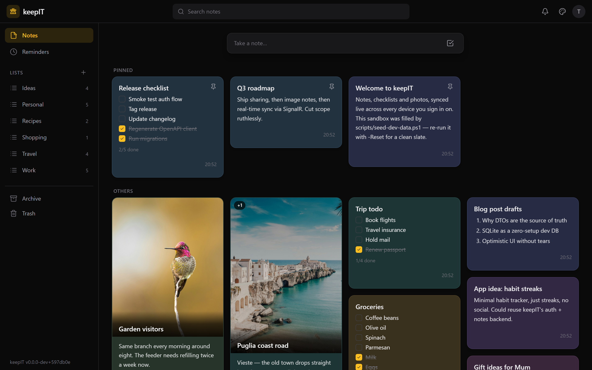
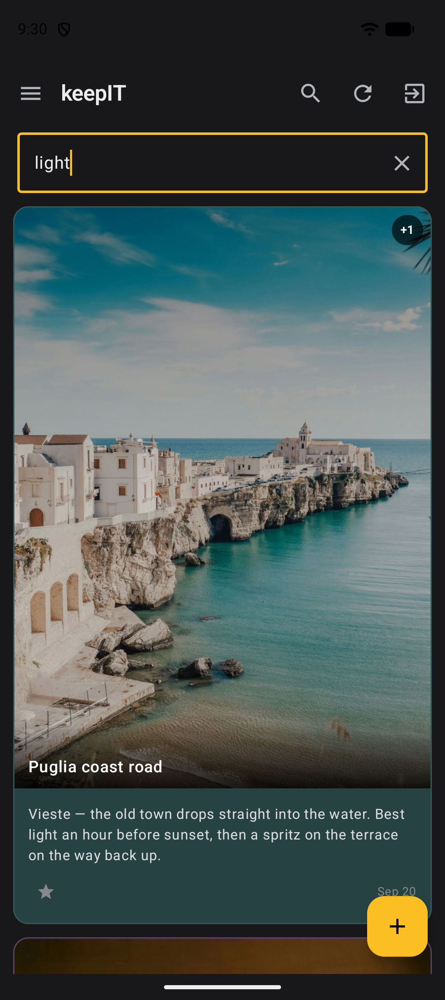

<div align="center">


# keepIT

**A modern, real-time notes app you can run yourself.**

[](https://hub.docker.com/r/richy1989/keepit)
[](#the-android-app)
[](LICENSE)


</div>

<div align="center">
  
  &nbsp;
  
</div>

Notes, checklists, lists, reminders and sharing — in a fast web app and a native Android client,
syncing live across your devices. Everything runs on your own server: no cloud account, no
subscription, and nobody else holding your notes. Just want notes on your phone? The Android app
also works entirely on its own, with no server at all.

**[Get it running](#quick-start)** with one Docker command — or
**[use the Android app standalone](#no-server-use-it-standalone)**.

<div align="center">

[](https://buymeacoffee.com/hyperstarit)

</div>

## What you can do with it

- 📝 **Notes your way** — text notes with rich formatting (bold, headings, lists, links, code),
  or checklists you tick off as you go.
- 🖼️ **Photos in your notes** — attach images to any note, up to ten each. Location data is
  stripped from every upload, so sharing a photo doesn't share where you took it.
- 🗂️ **Stay organized** — group notes into lists, pin the important ones, archive what's done,
  and find anything instantly with search. Deleted notes wait in the trash until you're sure.
- ⏰ **Reminders** — once, or on a schedule (daily, weekly, monthly, yearly). On your phone they
  arrive as real notifications, even with the app closed, the screen locked, or no internet.
- 👥 **Share notes** — invite someone by email to view or edit a note with you. You each keep
  your own pins, lists and reminders; edits show up for everyone, live.
- 🔄 **Always in sync** — change a note on one device and watch it update on the others. No
  refresh, no sync button.
- 📱 **Android app included** — the same notes on your phone, with a home-screen widget for
  recent notes and one-tap capture. It works fully offline: read and edit anywhere, and your
  changes sync as soon as you're back online.
- 📴 **No server? No problem** — the Android app also runs standalone: notes, lists, photos,
  reminders and the widget, all on your phone and nothing to set up. Connect a server later
  and everything moves into your account.
- 🎨 **Make it yours** — a background color per note, and an accent color for the whole app.
- 🔒 **Your notes stay yours** — everything lives on **your** server, or only on your phone. No
  third-party cloud, no account with anyone but yourself.

## Quick start

keepIT runs on your own machine or home server with **Docker**. One command, no database to set
up:

```bash
docker run -d \
  --name keepit \
  -p 8080:80 \
  -v keepit-data:/data \
  -e Jwt__Key="your-random-secret-at-least-32-chars" \
  richy1989/keepit:latest
```

Then open **http://localhost:8080** (or your server's address on port 8080) and create your
account. That's it.

A few things worth knowing:

- **`Jwt__Key`** is a secret that keeps your sign-ins secure — replace it with any random string
  of at least 32 characters, and keep it the same across restarts.
- **Your data** lives in the `keepit-data` volume — back that up and you've backed up your notes.
- **Once your accounts are created**, you can close public sign-up by adding
  `-e App__AllowRegistration=false` — recommended if your server is reachable from the internet.
- **Forgot password** works without any mail server: the reset link is written to the server
  log (`docker logs keepit`), where you — the operator — can grab it. To have it emailed to
  users instead, configure SMTP with the `Email__*` settings below.
- Running **Unraid**? A Community Apps template is included at
  [`deploy/keepit.unraid.xml`](deploy/keepit.unraid.xml).

<details>
<summary><strong>Prefer Docker Compose, Postgres, or building the image yourself?</strong></summary>

**Docker Compose** (three containers: app, web server, and a PostgreSQL database) — from a clone
of this repo:

```bash
cp .env.example .env          # set JWT_KEY (32+ chars), optionally POSTGRES_PASSWORD
docker compose up -d --build  # builds everything locally, then starts the stack
```

Open **http://localhost:8080**. Data persists in named Docker volumes.

**Use PostgreSQL with the single container** instead of the built-in database — either the
discrete variables (`POSTGRES_HOST` is the switch; port/db/user default to `5432`/`keepit`/`keepit`):

```bash
docker run -d \
  --name keepit \
  -p 8080:80 \
  -v keepit-data:/data \
  -e Jwt__Key="your-secret" \
  -e POSTGRES_HOST=<host> \
  -e POSTGRES_PASSWORD=<pass> \
  richy1989/keepit:latest
```

…or a full connection string (takes precedence when both are set):

```bash
docker run -d \
  --name keepit \
  -p 8080:80 \
  -v keepit-data:/data \
  -e Jwt__Key="your-secret" \
  -e "ConnectionStrings__Postgres=Host=<host>;Port=5432;Database=keepit;Username=keepit;Password=<pass>" \
  richy1989/keepit:latest
```

**Build the image yourself** (no Docker Hub needed):

```bash
docker build -f deploy/Dockerfile -t keepit:local .
docker run -d --name keepit -p 8080:80 -v keepit-data:/data \
  -e Jwt__Key="your-random-secret-at-least-32-chars" keepit:local
```

</details>

<details>
<summary><strong>All settings (environment variables)</strong></summary>

| Variable | Required | Default | Description |
| --- | --- | --- | --- |
| `Jwt__Key` | **yes** | — | Random secret, min 32 chars — keeps sign-ins secure. **The variable the app actually reads**; use it for `docker run` / Unraid / the single-container image. |
| `JWT_KEY` | compose only | — | Convenience `.env` value that `docker-compose.yml` passes through as `Jwt__Key`. Not read directly by the app. |
| `ConnectionStrings__Postgres` | no | *(built-in SQLite)* | Full Postgres connection string. If neither this nor `POSTGRES_HOST` is set, a zero-setup SQLite database is used. Takes precedence over the discrete `POSTGRES_*` variables below. |
| `POSTGRES_HOST` | no | — | Postgres host — the friendlier alternative to a full connection string: setting it switches the API to Postgres, built from the `POSTGRES_*` variables. |
| `POSTGRES_PORT` | no | `5432` | Postgres port (discrete setup only). |
| `POSTGRES_DB` | no | `keepit` | Postgres database name (discrete setup only). |
| `POSTGRES_USER` | no | `keepit` | Postgres username (discrete setup only). |
| `POSTGRES_PASSWORD` | no | `keepit` | Postgres password. Read by the API for the discrete setup, and by the Compose stack for both the `db` service and the connection string it hands the API. |
| `App__AllowRegistration` | no | `true` | Whether new accounts may be created. On an internet-exposed instance: register your own accounts first, then set `false` to close public sign-up. |
| `App__DataRoot` | no | `./App_Data` | Directory for the database, security keys, and media. |
| `App__ForwardedProxyHops` | no | `1` | Trusted reverse-proxy hops in front of the app — `1` for the plain setups above, `2` if you put another proxy (e.g. Traefik) in front. |
| `App__PublicBaseUrl` | no | *(auto-detected)* | Public address of your instance (e.g. `https://notes.example.com`), used to build password-reset links. Usually auto-detected from the request; set it if reset links point to the wrong host. |
| `Email__SmtpHost` | no | — | SMTP server for outgoing email (password-reset links). Leave empty to run without email — reset links then land in the server log. |
| `Email__From` | with SMTP | — | From address, e.g. `keepIT <no-reply@example.com>`. Required once `Email__SmtpHost` is set. |
| `Email__SmtpUsername` | no | — | SMTP login username. Leave empty (along with the password) for an unauthenticated relay. |
| `Email__SmtpPassword` | no | — | SMTP login password, paired with `Email__SmtpUsername`. |
| `Email__SmtpPort` | no | `587` | SMTP port — `587` for STARTTLS submission, `465` for implicit TLS (set `Email__UseStartTls=false` too). |
| `Email__UseStartTls` | no | `true` | `true` = STARTTLS (port 587); `false` = implicit TLS (port 465). |
| `Auth__RefreshCookie__Secure` | no | `true` (Compose) / `false` (single container) | Sign-in cookie is HTTPS-only. Keep `true` behind TLS; set `false` only when serving plain HTTP on a non-localhost address (e.g. a LAN IP without TLS). |
| `Jwt__Issuer` / `Jwt__Audience` | no | `keepITCore` / `keepIT.api` | Advanced: token claims. |
| `Jwt__AccessTokenMinutes` / `Jwt__RefreshTokenDays` | no | `15` / `14` | Advanced: how long sign-in tokens last. |
| `ASPNETCORE_ENVIRONMENT` | no | `Production` | Set to `Development` for verbose logging and the API explorer at `/scalar/v1`. |

The Compose stack sets most of these itself and reads only five values from `.env`: `JWT_KEY`,
`POSTGRES_PASSWORD`, `REFRESH_COOKIE_SECURE`, `FORWARDED_PROXY_HOPS`, and `ALLOW_REGISTRATION`.

</details>

## The Android app

The app in [`app/`](app) brings your notes to your phone: offline-first, live sync, native
reminder notifications, note sharing, and a home-screen widget — with your own server, or
standalone without one.

### No server? Use it standalone

Tap **Use without a server** on the sign-in screen and the app works entirely on your phone —
notes, checklists, lists, images, reminders and the widget, with nothing to install anywhere
else. Sharing and syncing with other devices need a server, so they're switched off.

When you do set up a server, open **Settings → Connect to a server** and sign in: everything on
the phone is uploaded into that account (alongside anything already in it) and syncs from then
on. A photo the server won't take (over 10 MB, or HEIC) is saved to your gallery instead of
being lost. Until then, standalone notes live only on the phone — there's no backup, and
**Settings → Erase notes** deletes them for good.

### Get it

<a href="http://apps.obtainium.imranr.dev/redirect.html?r=obtainium://add/https://github.com/Richy1989/keepIT"></a>
&nbsp;&nbsp;
<a href="https://gitlab.com/fdroid/fdroiddata/-/merge_requests/43792"></a>
<sup>coming soon</sup>

**[Obtainium](https://github.com/ImranR98/Obtainium)** is the easiest way: tap the badge, or add
`https://github.com/Richy1989/keepIT` as a GitHub app source. It installs the APK and keeps it
up to date as new releases land — no store account, straight from this repo.

**F-Droid** is on the way — the [submission](https://gitlab.com/fdroid/fdroiddata/-/merge_requests/43792)
is with the maintainers.

Prefer to do it by hand? Grab `keepit-vX.Y.Z-universal.apk` from the
[latest release](https://github.com/Richy1989/keepIT/releases/latest) and sideload it.

> **Heads up:** the GitHub and F-Droid builds are signed with different keys, so you can't move
> from one to the other by updating — pick a source and stay with it, or uninstall first.

### Build it yourself

Open `app/` in **Android Studio**, or from the command line (requires the Android SDK):

```bash
cd app
./gradlew :app:assembleDebug     # build the APK
./gradlew :app:installDebug      # or install straight onto a connected phone
```

On first launch, enter your **server address** on the sign-in screen — the same URL you open in
the browser (from the Android emulator, your own machine is `http://10.0.2.2:5025`) — or tap
**Use without a server** to try it standalone. For
reminders that fire on the minute even while your phone sleeps, grant **Alarms & reminders**
in the app's Settings screen.

## What's next

keepIT is a work in progress and actively developed. Up next:

- 🖼️ **Background images** — use a photo as a note's background (attaching images already works).
- ✉️ **Invite anyone** — share a note with someone who hasn't signed up yet.

## For developers

Curious how it works, or want to hack on it? **[`ARCHITECTURE.md`](ARCHITECTURE.md)** holds the
full design and the reasoning behind it. The short version: an ASP.NET Core (.NET 10) REST API
plus SignalR for realtime, a React 19/TypeScript web app, and a Kotlin/Jetpack Compose Android
app — all speaking the same API, with the C# DTOs as the single source of truth for the contract
(the typed TypeScript client is generated from OpenAPI: `cd web && npm run generate:api`).

You'll need the **.NET 10 SDK** and **Node.js 22+**. No database setup — a SQLite dev database
is created for you. One command builds and runs both halves, seeding test data on first run:

```bash
bash deploy/run-dev.sh        # Windows: ./deploy/run-dev.ps1
```

That serves the web app on **http://localhost:5173** and the API on **http://localhost:5025**
(API explorer at `/scalar/v1`), signed in as `test@test.com` / `Test1234#1234`. Ctrl+C stops both.

<details>
<summary><strong>Prefer to start the two halves yourself?</strong></summary>

```bash
# 1) Backend — http://localhost:5025 (Scalar API UI at /scalar/v1)
dotnet run --project keepIT/keepITCore

# 2) Frontend — http://localhost:5173 (proxies /api to the backend)
cd web && npm install && npm run dev
```

Open **http://localhost:5173** and register an account — or seed test data
(`test@test.com` / `Test1234#1234`, plus lists and a variety of notes):

```bash
bash scripts/seed-dev-data.sh        # PowerShell twin: ./scripts/seed-dev-data.ps1
```

</details>

## Why I built this

Honestly? I just wanted a simple notes app, and couldn't find one with the three things I
actually cared about — so I built it myself. With a little AI help 😉, modern problems require
modern solutions.

The features I really wanted:

- a simple notes app with a modern web UI
- note sharing between different users
- a native Android app, including a home-screen widget

It has since grown into a blazing-fast app with optimistic editing, lists, search, sharing, and
**real-time sync** — so a note edited on one device shows up on your others without a refresh.
I'm really happy with how this turned out.

## Support

keepIT is free and self-hosted — no accounts, no subscriptions. If it's useful to you and you'd
like to say thanks, you can [**buy me a coffee** ☕](https://buymeacoffee.com/hyperstarit). Much
appreciated, but never expected.

## License

Released under the [MIT License](LICENSE) — © 2026 Richard Leopold. Free to use, modify, and
distribute; just keep the copyright and license notice.
